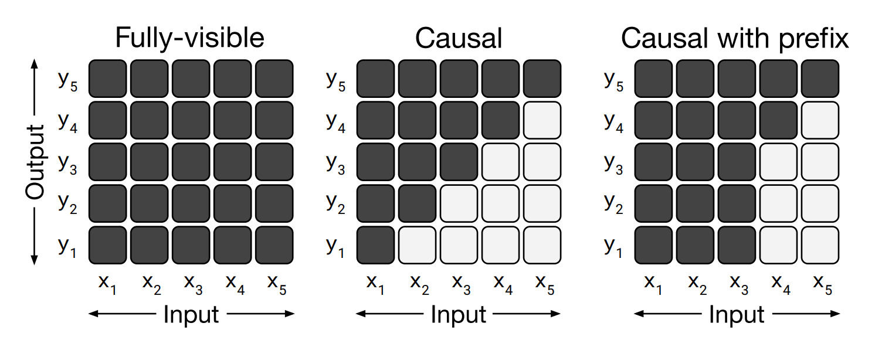
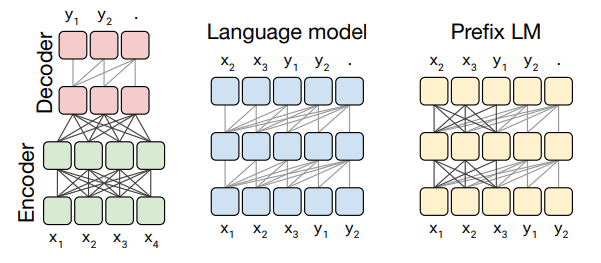
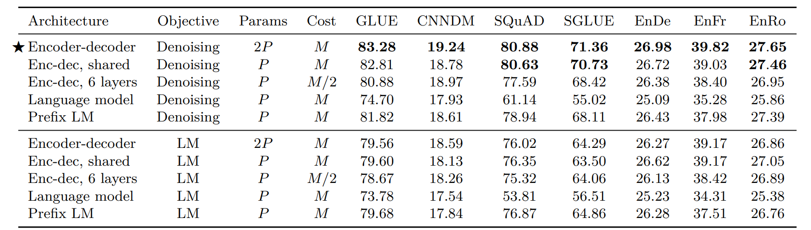
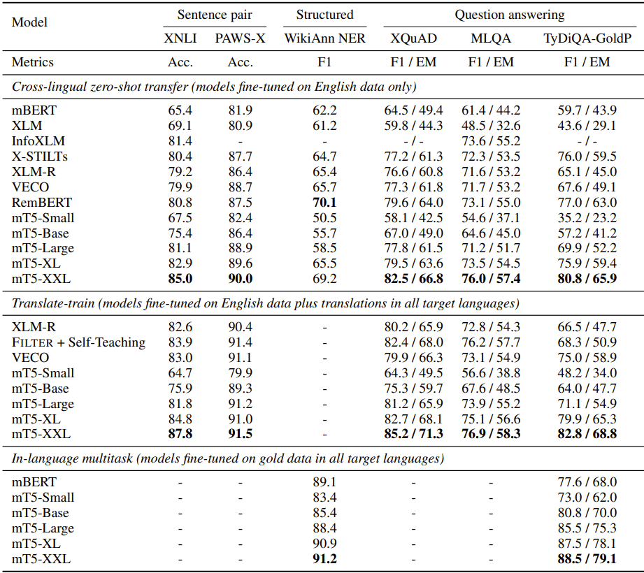

# mT5: A Massively Multilingual Pre-Trained Text-To-Text Transformer

## Authors
1. Akhil Eppa - <a href="aeppa@cs.cmu.edu">aeppa@cs.cmu.edu</a>
2. R Raghav - <a href="rraghavr@cs.cmu.edu">rraghavr@cs.cmu.edu</a>

  \( p(L) \propto |L|^{\alpha} \)

## Introduction
In this blog post, we'll delve into the intricacies of the mT5 model, a multilingual iteration of the T5 model. This variant has undergone training on a new dataset, showcasing improved performance across a diverse range of multilingual benchmarks. Notably, the mT5 model exhibits enhancements in tasks associated with the multilingual setting, all while leveraging the robust architecture of the "Text-to-Text Transformer" (T5) model.

By exploring this blog, you'll gain a comprehensive understanding of the mT5 model, unraveling its background and the journey that led to its development. We aim to shed light on the nuances behind the mT5 model, highlighting its features and the impact it has in the realm of multilingual natural language processing.

## Background
To gain a better understanding of the mT5 model, let's start by exploring an overview of the T5 model and delving into what it means to accomplish a multilingual task. The T5 model, short for Text-to-Text Transformer, is a cutting-edge model designed for processing natural language. Its strength lies in the transformer architecture, an advanced neural network that excels in capturing intricate relations within text sequences, making it particularly adept at understanding and generating textual content.

In simpler terms, think of the T5 model as a super-smart computer program capable of understanding and generating human-like text. To acquire this ability, the T5 model undergoes training on extensive datasets through an iterative learning process. This process refines its understanding of language structure and semantic relationships, turning it into a proficient text generator.

What makes the T5 model even more exciting is its versatility. It's not confined to a specific task but can accomplish a variety of them, including translating languages, summarizing text, answering questions, and more. You might wonder how a single model can perform such diverse tasks. This is achieved by adding task-specific prefixes to the input sequence and pre-training the model to produce prefix-specific outputs.The T5 model undergoes both unsupervised and supervised pre-training. In the unsupervised setting, spans are masked with a special token, and the model predicts the masked sequence. In the supervised setting, the input consists of the task name followed by the required input text, and the expected target text is provided as the corresponding output. This is just a high-level overview of the T5 model to set the stage for what comes next and bridge the gap in understanding the mT5 model.

*Illustration of the T5 Model. [Image Credits](https://blog.research.google/2020/02/exploring-transfer-learning-with-t5.html)*

Having explored the T5 model, you might be pondering why we need a new model when we already have such a capable one. The answer lies in the fact that these language models are primarily pre-trained on English-language text. Now, consider this: what percentage of the world's population doesn't speak English? A whopping 80%. Yes, you read that right. There is still a significant portion of our global community that doesn't communicate in English.

Efforts have been made to address this language gap by releasing additional models pre-trained on a single non-English language. However, this approach may not be scalable. Imagine trying to create a separate model for every language—it becomes impractical at a certain point. This is where the concept of a multilingual setting becomes crucial. In this setting, models are developed to be pre-trained on a mix of multiple languages, addressing the challenge of linguistic diversity more effectively.

Enter the mT5, a multilingual model aiming to bridge language gaps by utilizing the state-of-the-art Text-to-Text Transformer architecture. It's designed to be a versatile solution, capable of understanding and generating text in multiple languages. The mT5 model represents a step forward in making advanced language processing accessible to a more diverse global audience. 

## Introducing the mT5 Model
The Multilingual T5, or mT5 for short, is, as the name suggests, a multilingual variant of the popular T5 model. To achieve its multilingual capability, the model underwent pretraining on a dataset covering a staggering 101 different languages. The model itself boasts an impressive parameter range, spanning between 300 million and 13 billion. This encompasses five different variants, starting with the smaller variant containing 300 million parameters, and scaling up to the XXL variant with a substantial 13 billion parameters.

Through its extensive pretraining across a diverse array of languages, mT5 showcases its remarkable capacity to generalize across linguistic variations. This capability contributes significantly to the improvement of models in low-resource language domains. The architecture of mT5 facilitates effective information transfer and knowledge sharing among languages, highlighting its adaptability and utility in scenarios where linguistic resources are limited.

In the upcoming sections, we will delve into the preparation of the dataset on which the model was trained and explore the nuances of the training strategy. Specifically, we'll discuss how the training strategy, initially designed for the T5 model, was fine-tuned to cater to the unique requirements of the mT5 model. Additionally, we will examine the performance demonstrated by the mT5 model and engage in a discussion on its capabilities.

## The Data that powers the mT5 model
To enable the mT5 model to proficiently handle multiple languages, it undergoes training on a diverse dataset known as the mC4 dataset, encompassing text from a comprehensive set of 101 languages. Unlike the original T5 model, which relied on the English-only C4 dataset from Common Crawl, the mC4 dataset is a multilingual adaptation, recognizing the necessity for linguistic diversity.

The creation of this multilingual dataset involves meticulous approaches:

* Line length filters are implemented to ensure that at least three lines, each containing over 200 characters, are included. This filter addresses the variance observed in sentences of languages other than English within the C4 dataset.
* Identifying different languages within the dataset is accomplished using the Compact Language Detector V3 (CLD3). This tool assigns a confidence score along with the detected language, and only text pieces with a confidence score surpassing 70% are retained.
* Over 100 languages are encompassed by aggregating data from 71 monthly web scrapes released by Common Crawl. This stands in stark contrast to the original C4 dataset, where a single scrape sufficed, underscoring the challenge of obtaining comprehensive data when dealing with a multitude of languages.
* The final mC4 dataset selects text from various languages, retaining those with 10,000 or more pages, emphasizing a threshold for inclusion based on language volume.

It's crucial to recognize that the quality of the data profoundly influences model performance. Consequently, meticulous attention is dedicated to curating the dataset that serves as the foundation for training the mT5 model. In the subsequent sections, we'll delve into how this curated data is leveraged to train and optimize the capabilities of the mT5 model.

## Dive into mT5 Architecture
The architecture of mT5 closely followed that of the T5 model. In fact it is based on an improved version of the T5 model called the T5v1.1 which is a slight improvement of the T5 model with some minor architectural tweaks. Essentially the mT5 architecture can be understood by studying the architecture of the T5 model. 

### Attention Mask Patterns
It is important that we understand about the different attention mask patterns, before we proceed to understand T5 model architecture

The attention masks control which parts of the input elements the self-attention mechanism can focus on. The matrices visually represent these patterns.

Left - The fully-visible mask permits the self-attention mechanism to consider the entire input for every output step.

Middle - In contrast, the causal mask restricts the output at step 'i' from relying on input elements occurring after step 'i', preventing dependence on future elements.

Right - The causal mask with a prefix allows a hybrid approach by enabling unrestricted attention for a section of the input sequence while enforcing causal masking for the rest, maintaining the restriction on future elements for specific parts of the sequence.

### Model Architecture Candidates
When assessing various architectures suitable for language models, the authors of T5 primarily considered three types:

1. Encoder-Decoder: This conventional structure involves an encoder-decoder setup, utilizing full visibility in the encoder and encoder-decoder attention. Causal masking is implemented in the decoder to prevent future output dependencies, ensuring predictions are made without accessing information from future positions.

2. Language Model (LM): In this configuration, a single stack of Transformer layers forms the model. It receives the concatenation of input and target sequences while employing a causal mask consistently. As with typical language models, the output is restricted to attending only to past input or output elements.

3. Prefix LM: The Prefix LM is an extension of the language model, incorporating the allowance for fully-visible masking over a segment of the input. This variant operates similarly to an LM, with the distinction that the output attends to a specific portion of the input—typically containing task-specific information (like translating English to German)—present in the prefix.

The three model architecture types are depicted in the below figure - 

    

The authors found that the Transformer (Encoder-Decoder) based architecture exhibits superior performance compared to alternative architectures, as shown by the results below - 

## Specifics of mT5 Pre-Training
Now that we've grasped the intricacies of the model architecture and the intricately prepared dataset, let's delve into how these vital components synergize to craft the mT5 model. Examining the dataset crucial for training mT5, which spans 101 diverse languages, the process of sampling data during pre-training takes center stage. The methodology employed in pre-training mT5 to tackle this linguistic diversity is intriguing and noteworthy.

Enter the zero-sum game approach, a key player in the pre-training of mT5. Think of it as a delicate balancing act – akin to walking a tightrope between learning too much from languages with limited resources and not learning enough from languages with abundant resources. Picture this: if we focus too much on languages with scarce resources, the model might become too specialized (overfitting), and if we neglect languages with plenty of resources, the model might not generalize well (underfitting). Striking the right balance is where the zero-sum game comes into play, a strategy not entirely novel but drawn from previous research, ensuring mT5 learns effectively from a diverse linguistic landscape.

Diving into further technical aspects of this approach, low resource languages are boosted by sampling examples accoring to the probability equation represented by ${p(L)} {\propto} {|L|}^{\alpha}$. Let us break this down in order to understand the nuances better.  
1. **The Purpose: Focusing on Linguistic Diversity**
    * It's crucial to prioritize low-resource languages, ensuring they receive more attention than their high-resource counterparts.
    * In the equation $p(L) \propto {|L|}^{\alpha}$, $p(L)$ signifies the likelihood of selecting text from a specific language ${L}$ during training, while ${|L|}$ represents the count of instances (sentences or text pieces) in language ${L}$.
2. **Understanding Hyperparameter $\alpha$: A Tuning Knob**
    * The hyperparameter $\alpha$ quantifies the boost given to low-resource languages during pre-training. Adjusting $\alpha$ allows for fine-tuning this boost, and the value of $\alpha$ is determined through experimentation.
    * Typically set to a value less than 1 (e.g., 0.8, 0.6, or 0.3), $\alpha$ plays a pivotal role in shaping the model's attention distribution.
3. **Determining the Optimal $\alpha$**
    * To identify the most effective $\alpha$ for the mT5 setting, experiments were conducted with values from prior research: 0.7, 0.3 and 0.2.
    * After experimenting with these 3 values it was found that $\alpha = 0.3$ worked most optimally, in the sense that it struck a balance, showcasing optimal model performance across both low-resource and high-resource languages.  

In essence, this dynamic approach adjusts the attention given to different languages during the pre-training process, ensuring the model learns effectively from a diverse linguistic landscape. As mentioned earlier, the $\alpha$ parameter becomes the key to striking the right balance, making the mT5 model versatile and robust in handling various language scenarios, which we will further discuss in subsequent sections.

## Experiments
The evaluation of mT5 involved testing its performance across six tasks sourced from the XTREME multilingual benchmark. These tasks covered multilingual challenges such as entailment, reading comprehension, named entity recognition, and paraphrase identification in various languages. The approach included transforming tasks into a text-to-text format, generating label text, entity tags, or direct answers. Three task variants were explored: "zero-shot" fine-tuning on English data only, "translate-train" with machine translations into target languages, and "in-language multitask" with training on available gold data in all target languages.

In accordance with the original T5 framework, the study explores five model sizes: Small (around 300 million parameters), Base (580 million), Large (1.2 billion), XL (3.7 billion), and XXL (13 billion). The increase in parameter count in mT5 compared to T5 models is attributed to a larger vocabulary. Notably, mT5, as an encoder-decoder model, approximately doubles the parameters of similarly sized encoder-only models like XLM-R. For instance, while the XLM-R "Large" variant has 550 million parameters, mT5-Large has roughly 1 billion. However, the computational expense for text classification remains similar. In both models, a sequence of length 'T' is processed by an encoder of nearly equal size. While an encoder-only model like XLM-R deals with one additional "CLS" token for classification, mT5's decoder usually generates two extra tokens: the class label and an end-of-sequence token. Despite this, the computational cost for classification with mT5 usually involves processing 'T + 2' tokens, compared to 'T + 1' for an encoder-only model. Notably, the encoder-decoder architecture offers added versatility for generative tasks like abstractive summarization or dialogues.

Their pre-training methodology involved training mT5 model variants for a million steps, each on batches comprising 1024 sequences of length 1024, totaling roughly 1 trillion input tokens. This pre-training duration matches that of T5 and is approximately one-sixth of XLM-R's pre-training scale. They adopted T5's inverse square-root learning rate schedule during pre-training. Aligning with the T5v1.1 approach, dropout was not applied during pre-training. Their self-supervised objective mirrored T5, involving masking 15% of tokens with an average noise span length of 3. For fine-tuning, a constant learning rate of 0.001 and a 0.1 dropout rate were employed across all tasks. While most tasks used a batch size of 2^17, in a few cases, they scaled this up to 2^20 based on validation set performance.

## Results
Their comprehensive results showcase the exceptional performance of the mT5-XXL model, surpassing state-of-the-art benchmarks in classification and QA tasks, with a nearly competitive standing in NER (69.2 compared to 70.1). Notably, InfoXLM and VECO benefit from parallel training data, while X-STILTs utilizes labeled data akin to the target task. These outcomes emphasize the significance of model capacity in cross-lingual representation learning, suggesting that amplifying a straightforward pre-training approach can be a promising alternative to more intricate methodologies relying on LM filtering, parallel data, or intermediary tasks. Particularly in the "translate-train" scenario, the performance outstrips state-of-the-art standards across all XTREME classification and QA tasks by fine-tuning on a combination of labeled English data and its machine translations.

In exploring mT5's performance, a noteworthy trend surfaced across different model sizes and training approaches. Smaller models excelled when trained on gold datasets in various languages compared to weakly supervised or English-only training. However, this advantage diminished for larger models, where the impact of machine translations decreased as model capacity increased. This suggests the potential to bypass costly multilingual data annotation, particularly with larger models. While initially underperforming, larger mT5 models approach dedicated language-specific models' performance, indicating a capacity threshold where the model effectively manages multiple languages without significant interference effects. This observation was reinforced by comparisons between mT5 and T5 models, showcasing that larger mT5 models narrow the performance gap, hinting at a point where the model efficiently learns and handles diverse languages.

    
    
<b>Results of mT5, referenced from the paper</b>

## Zero-Shot Generation Setting
mT5, a generative model, differs from "encoder-only" models like mBERT by freely generating text predictions. However, in unseen languages during fine-tuning, it occasionally struggles to create well-formed predictions, particularly evident in tasks like XQuAD zero-shot due to inadvertent translation into the fine-tuning language (English). The blog section explores this behavior and its remedy: incorporating a fraction of the multilingual pre-training task during fine-tuning to alleviate these errors.

In the realm of span selection tasks, the use of generative models, such as mT5, aims to generate "legal" spans that are subsets of the provided context, unlike strict constraints in encoder-based models like BERT. While mT5 consistently produces legal spans on SQuAD, zero-shot cross-lingual span selection poses a more intricate challenge. Despite achieving state-of-the-art results on zero-shot variants of XQuAD, MLQA, and TyDi QA, mT5 encounters issues with illegal predictions. These problematic predictions fall into three main categories: normalization, grammatical adjustments, and accidental translation. For instance, in cases of normalization, certain Unicode characters substitution occurs, notably in Thai, Chinese, and Hindi, which can be rectified through Unicode NFKC normalization. Grammatical adjustments often stem from languages with extensive grammatical case marking, such as Russian, Turkish, and German, where the model modifies the original text for improved grammar. Accidental translation emerges when the model translates part or all of a contextual span into English, despite solely being fine-tuned on English data, leading to partial or full translations into English even within non-English target languages like Greek and Russian. While this spontaneous translation showcases the model's capabilities, addressing and controlling this behavior remains a challenge for practitioners.

In addressing the challenge of accidental translation in span selection tasks, the authors explore a more general solution that aligns with the text-to-text framework applicable to all zero-shot generation tasks. Rather than task-specific modifications that limit the model's predictions to legal spans or outputs, they delve into the model's learning process during fine-tuning. Recognizing that the absence of exposure to non-English targets during fine-tuning leads the model to favor English outputs, they introduce a strategy inspired by domain-adaptive pre-training, infusing unsupervised multilingual tasks during fine-tuning to maintain the model's proficiency in generating multiple languages. By incorporating a small portion of multilingual data into the fine-tuning process, they observed a substantial reduction in illegal prediction rates, particularly benefiting mT5-Small and mT5-Base models, ultimately mitigating errors in span selection tasks like XQuAD.

## Comparison with Other Models
To truly grasp the capabilities of the mT5 model, it's valuable to briefly explore the achievements of other models in this domain. Let's delve into a few models supporting at least a few dozen languages for a fair comparison:
1. **mBERT**  
    Starting with mBERT, a multilingual variant of the renowned BERT model, it closely follows BERT's architecture and objectives. However, the training data diverges, with mBERT relying on text from 104 languages extracted from Wikipedia instead of BERT's English Wikipedia and Toronto Book Corpus.
2. **XLM**  
    XLM builds upon BERT, incorporating enhanced methods for pre-training multi-lingual language models. It introduces explicitly cross-lingual pre-training objectives to broaden its language capabilities.
3. **XLM-R**  
    As the name suggests, XLM-R is an advancement of the XLM model, based on RoBERTa. Trained on data from Common Crawl in 100 languages, it employs a cross-lingual masked language model objective for improved performance.
4. **mBART**  
    Derived from the BART model, mBART boasts a multilingual encoder-decoder architecture. Its training incorporates a blend of span masking and sentence shuffling objectives. The dataset comprises a subset of 25 languages, sourced from the same data pool as XLM-R.
5. **MARGE**  
    MARGE, a multilingual encoder-decoder model, is trained to reconstruct a document in one language using data extracted from documents in other languages. The dataset encompasses text from 26 diverse languages, originating from Wikipedia and CC-News.

In order to obtain a quick comparison of the mT5 model with the other multilingual language models mentioned above, check out the table below. It provides a snapshot of key parameters, supported languages, and data sources for models like mBERT, XLM, XLM-R, mBART, MARGE, and finally the mT5

| Model                       | Architecture   | Parameters | # Languages | Data Source               |
|-----------------------------|----------------|------------|--------------|---------------------------|
| mBERT        | Encoder-only   | 180M       | 104          | Wikipedia                |
| XLM| Encoder-only   | 570M       | 100          | Wikipedia                |
| XLM-R| Encoder-only   | 270M – 550M | 100          | Common Crawl (CCNet)     |
| mBART  | Encoder-decoder | 680M       | 25           | Common Crawl (CC25)      |
| MARGE  | Encoder-decoder | 960M       | 26           | Wikipedia or CC-News    |
| mT5                  | Encoder-decoder | 300M – 13B  | 101          | Common Crawl (mC4)       |

*Table: A comparison of multilingual language models.*

## Wrapping it up (Conclusion)

## References

1. Xue, Linting, et al. "mT5: A massively multilingual pre-trained text-to-text transformer." arXiv preprint arXiv:2010.11934 (2020).
2. Roberts, Adam, et al. "Exploring the limits of transfer learning with a unified text-to-text transformer." (2019).